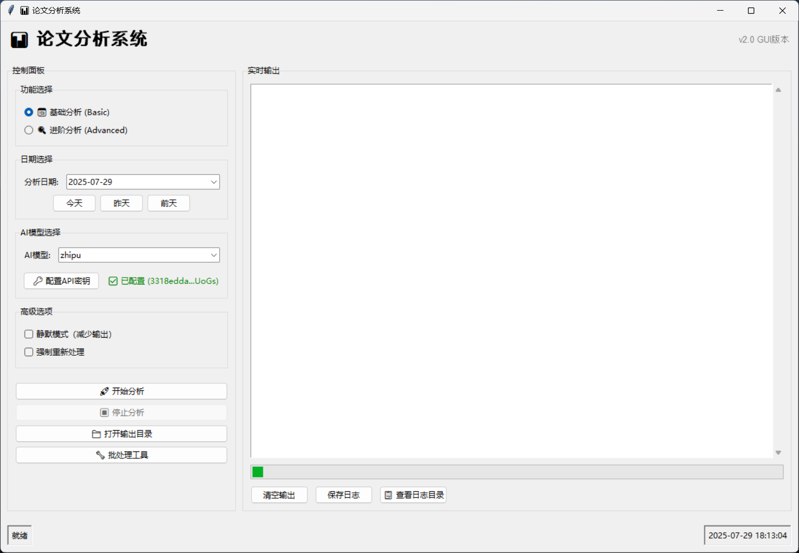
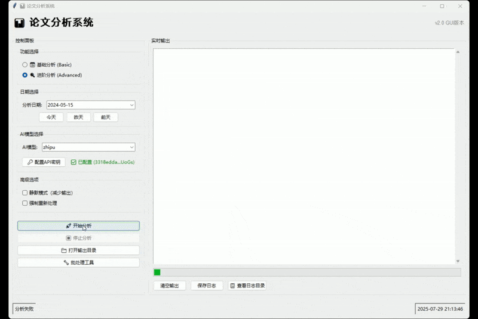
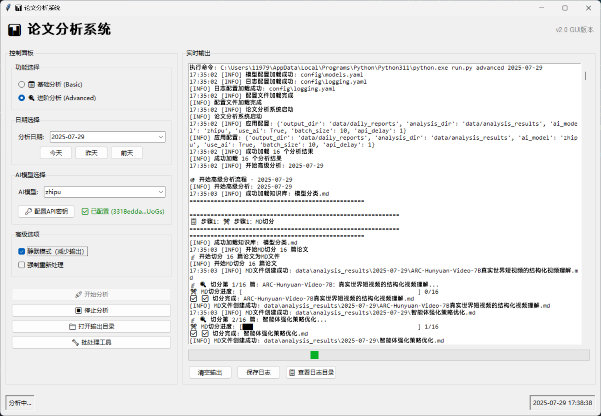
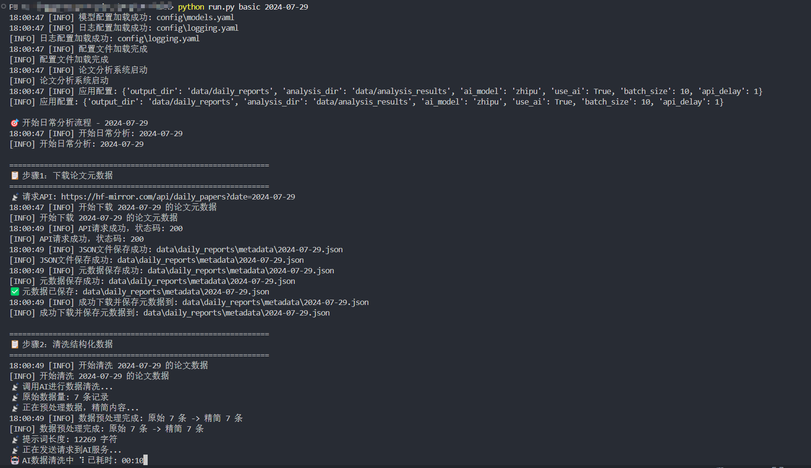

# 🤖 AI Paper Intelligence Analysis System

<div align="center">

[English](./README.en.md) | [简体中文](./README.md)

</div>

> **One-click fetch, intelligent analysis, automatic classification** - Let AI help you read papers and escape from information overload!

[](https://python.org)
[](LICENSE)
[](#)

Hundreds of AI papers are published daily - tired of manual screening? Let AI help you! This system automatically fetches the latest papers from HuggingFace, uses multiple AI models for intelligent analysis and classification, and generates readable analysis reports.

<!-- 📸 Screenshot needed: Main interface -->



## ⚡ Get Started in 30 Seconds

### 🎨 GUI Version (Recommended for Beginners)

```bash
python run_gui.py
```

**Zero barrier to entry**: Click "Start Analysis" → Select Date → Wait for Completion ✨

<!-- 📸 Screenshot needed: GUI workflow -->




### 💻 Command Line Version (Recommended for Professionals)

```bash
python run.py basic 2025-07-29
```

**One command does it all**: Auto-download, analyze, generate reports

<!-- 📸 Screenshot needed: CLI execution process -->


## 🎯 Core Features

| Feature                     | Description                                  | Value                                          |
| --------------------------- | -------------------------------------------- | ---------------------------------------------- |
| 📡 **Auto Fetch**           | Get latest paper data from HuggingFace       | No manual search, ensure nothing is missed     |
| 🤖 **AI Analysis**          | Support Zhipu AI, Doubao, OpenAI, Qwen, etc. | Multi-model cross-validation, improve accuracy |
| 📊 **Smart Classification** | Automatic tagging and topic categorization   | Quickly locate research areas of interest      |
| 📈 **Visual Reports**       | Generate structured analysis reports         | Clear research trends and hotspots at a glance |
| ⚡ **Batch Processing**     | Support multi-date batch analysis            | Efficiently process large amounts of data      |
| 🔄 **Incremental Updates**  | Intelligently detect processed content       | Avoid duplicate work, save time                |

## 🚀 Use Cases

### 👨‍🔬 Researchers

- **Quick field updates**: Daily auto-fetch relevant paper abstracts
- **Discover research hotspots**: AI automatically identifies trending research directions
- **Track competitors**: Monitor latest achievements from specific institutions or authors

### 👨‍💼 Product Managers

- **Technology trend analysis**: Understand AI technology development directions
- **Competitive tech research**: Analyze competitors' technology layouts
- **Product planning reference**: Make product roadmaps based on latest research

### 👨‍💻 Developers

- **Technology selection reference**: Learn about latest algorithms and tools
- **Learning resource discovery**: Find papers worth deep research
- **Inspiration source**: Get project ideas from latest research

### 👨‍🎓 Students and Scholars

- **Literature research**: Quickly filter relevant research literature
- **Study planning**: Adjust learning focus based on hotspots
- **Paper writing**: Understand latest research status and development trends

## 🛠️ Installation & Configuration

### 1. Environment Setup

```bash
# Clone project
git clone https://github.com/ZsTs119/ai-paper-analyzer.git
cd ai-paper-analyzer

# Install dependencies
pip install -r requirements.txt
```

### 2. API Key Configuration

Support multiple AI services, choose one:

| AI Service | Environment Variable | Get Address                                                                                                    |
| ---------- | -------------------- | -------------------------------------------------------------------------------------------------------------- |
| Zhipu AI   | `ZHIPUAI_API_KEY`    | [Zhipu AI Open Platform](https://www.bigmodel.cn/invite?icode=hk0Lc1L7oGy17bOhwrIMDGczbXFgPRGIalpycrEwJ28%3D/) |
| Doubao AI  | `ARK_API_KEY`        | [Volcano Engine](https://console.volcengine.com/)                                                              |
| OpenAI     | `OPENAI_API_KEY`     | [OpenAI Platform](https://platform.openai.com/)                                                                |
| Qwen       | `DASHSCOPE_API_KEY`  | [Alibaba Cloud DashScope](https://dashscope.aliyun.com/)                                                       |

**Method 1: GUI Configuration (Recommended)**

```bash
python run_gui.py
# Click "Configure API Key" button, enter key and test connection
```

<!-- 📸 Screenshot needed: API key configuration interface -->


**Method 2: Environment Variables**

```bash
# Windows
set ZHIPUAI_API_KEY=your_api_key_here

# Linux/Mac
export ZHIPUAI_API_KEY=your_api_key_here
```

### 3. Verify Installation

```bash
python run.py status  # Check system status
```

## 📖 User Guide

### 🎨 GUI Interface (Zero Barrier)

1. **Launch Interface**

   ```bash
   python run_gui.py
   ```

2. **Basic Operations**

   - Select AI model (Zhipu AI, Doubao, etc.)
   - Click "Configure API Key" to set key
   - Select analysis date
   - Click "Start Analysis"

3. **Advanced Features**
   - Real-time analysis progress
   - Silent mode operation
   - Batch process multiple dates

<!-- 📸 Screenshot needed: GUI detailed operation steps -->




### 💻 Command Line Scripts (Professional & Efficient)

#### Basic Analysis

```bash
# Analyze today's papers
python run.py basic

# Analyze specific date
python run.py basic 2025-07-29

# Silent mode
python run.py basic 2025-07-29 --silent
```

#### Advanced Analysis

```bash
# Deep analysis of basic analysis results
python run.py advanced 2025-07-29

# Auto mode (recommended)
python run.py advanced --auto
```

#### Batch Processing

```bash
# Batch analyze multiple dates
python tools/batch_processor.py daily --start 2025-07-25 --end 2025-07-29

# Complete pipeline processing
python tools/batch_processor.py pipeline --start 2025-07-25 --end 2025-07-27
```

#### System Status

```bash
# View configuration and running status
python run.py status
```

<!-- 📸 Screenshot needed: CLI execution examples -->




## 📊 Output Results

### 📁 File Structure

```
data/
├── daily_reports/           # Basic analysis results
│   ├── metadata/           # Original paper metadata
│   ├── cleaned/            # Cleaned structured data
│   └── reports/            # Generated analysis reports
└── analysis_results/       # Advanced analysis results
    ├── categories/         # Classification statistics
    ├── trends/            # Trend analysis
    └── summaries/         # Comprehensive reports
```

### 📋 Report Content

- **Paper Abstracts**: AI-extracted key information
- **Technical Classification**: Auto-identified research fields
- **Innovation Analysis**: Main contributions of papers
- **Application Scenarios**: Potential practical applications
- **Technology Maturity**: Assessment of technology development stage
- **Trend Analysis**: Research hotspots and development directions

<!-- 📸 Screenshot needed: Analysis report example -->


## 🔧 Advanced Configuration

### AI Model Configuration

Edit `config/models.yaml` to customize AI model parameters:

```yaml
ai_models:
  zhipu:
    name: "Zhipu AI"
    default_model: "GLM-4.5-Air"
    api_base: "https://open.bigmodel.cn/api/paas/v4/"
    max_tokens: 4000
    temperature: 0.3
  openai:
    name: "OpenAI"
    default_model: "gpt-4"
    api_base: "https://api.openai.com/v1/"
    max_tokens: 4000
    temperature: 0.3
```

### Logging Configuration

Edit `config/logging.yaml` to adjust log level and output format:

```yaml
version: 1
formatters:
  default:
    format: "%(asctime)s [%(levelname)s] %(message)s"
handlers:
  console:
    class: logging.StreamHandler
    level: INFO
    formatter: default
  file:
    class: logging.FileHandler
    level: DEBUG
    formatter: default
    filename: logs/app.log
```

### Application Configuration

Edit `config/app.yaml` to modify output directory, batch size, etc.:

```yaml
output_dir: "data/daily_reports"
analysis_dir: "data/analysis_results"
ai_model: "zhipu"
use_ai: true
batch_size: 10
api_delay: 1
```

## 🎨 Classification System

The system supports the following intelligent classifications:

### 🤖 AI Model Categories

- **Text Generation**: Large language models, dialogue systems, text summarization
- **Image Generation**: Image synthesis, style transfer, image editing
- **Video Generation**: Video synthesis, animation generation, video editing
- **Audio Generation**: Speech synthesis, music generation, audio processing
- **3D Generation**: 3D modeling, scene generation, virtual reality
- **Multimodal Generation**: Cross-modal conversion, multimodal understanding
- **Cross-modal Generation**: Text-to-image, image-to-text, etc.
- **Game & Strategy Generation**: Game AI, strategy optimization
- **Scientific Computing & Data Generation**: Scientific simulation, data analysis

<!-- 📸 Screenshot needed: Classification results -->


## 🎯 Best Practices

### 📅 Daily Usage Recommendations

1. **Daily scheduled runs**: Recommend running previous day's analysis every morning
2. **Choose appropriate AI model**: Zhipu AI for cost-effectiveness, OpenAI for better quality
3. **Batch processing**: Process weekly data in batches on weekends
4. **Regular cleanup**: Regularly clean old analysis results to save storage space

### ⚡ Performance Optimization

1. **Concurrent processing**: Increase `batch_size` parameter to improve processing speed
2. **API rate limiting**: Adjust `api_delay` to avoid triggering API limits
3. **Cache utilization**: Repeated analysis automatically uses cached results

### 🛡️ Error Handling

1. **Network issues**: System automatically retries, no manual intervention needed
2. **API limits**: Automatically reduces request frequency
3. **Data anomalies**: Abnormal data will be marked and skipped

## 🔍 Troubleshooting

### Common Issues & Solutions

#### 1. API Key Related Issues

**Issue**: "Invalid API key" prompt

```
❌ API key invalid or expired
```

**Solutions**:

- Check if API key is correctly copied (watch for leading/trailing spaces)
- Confirm API key hasn't expired and has sufficient balance
- Use GUI's "Test Connection" feature to verify key

**Issue**: "Insufficient API permissions" prompt

```
❌ Insufficient API key permissions, please check model access rights
```

**Solutions**:

- Confirm API key has access to corresponding model
- Contact AI service provider to enable appropriate permissions
- Try using other supported AI models

#### 2. Network Connection Issues

**Issue**: Connection timeout or network errors

```
❌ Connection timeout, please check network connection
❌ Network connection failed, please check network settings
```

**Solutions**:

- Check if network connection is normal
- Confirm firewall isn't blocking program network access
- If on corporate network, contact network admin to open relevant domain access
- Try using VPN or proxy

#### 3. Encoding Issues

**Issue**: Encoding errors on Windows

```
'gbk' codec can't encode character
```

**Solutions**:

- Ensure using UTF-8 encoded terminal
- Run in PowerShell: `chcp 65001`
- Use GUI version to avoid encoding issues

#### 4. Dependency Package Issues

**Issue**: Missing dependency packages

```
ModuleNotFoundError: No module named 'xxx'
```

**Solutions**:

```bash
# Reinstall dependencies
pip install -r requirements.txt

# Or install missing package individually
pip install package_name
```

#### 5. Permission Issues

**Issue**: Insufficient file write permissions

```
PermissionError: [Errno 13] Permission denied
```

**Solutions**:

- Ensure write permissions to project directory
- Windows users can try running as administrator
- Check if data directory exists and is writable

### 📋 System Requirements

#### Minimum Requirements

- **Python**: 3.8+
- **Memory**: 4GB RAM
- **Storage**: 2GB available space
- **Network**: Stable internet connection

#### Recommended Configuration

- **Python**: 3.10+
- **Memory**: 8GB+ RAM
- **Storage**: 10GB+ available space (for storing analysis results)
- **Network**: High-speed stable network connection

### 🐛 Debug Mode

Enable verbose logging:

```bash
# Set log level to DEBUG
export LOG_LEVEL=DEBUG

# Or modify in config file
# config/logging.yaml
```

View detailed error information:

```bash
# Use --verbose parameter
python run.py basic 2025-07-29 --verbose

# View log file
tail -f logs/app.log
```

## 🤝 Contributing

Welcome to submit Issues and Pull Requests!

### Development Environment Setup

```bash
# Install development dependencies
pip install -r requirements-dev.txt

# Run tests
python -m pytest tests/

# Code formatting
black src/ tests/
```

### Commit Guidelines

- Feature development: `feat: add new feature`
- Bug fixes: `fix: fix some issue`
- Documentation updates: `docs: update documentation`

## ❓ Frequently Asked Questions (FAQ)

### Q1: Which AI models are supported?

**A**: Currently supports the following AI models:

- **Zhipu AI**: GLM-4.5-Air, GLM-4, etc.
- **Doubao AI**: doubao-pro-32k, etc.
- **OpenAI**: GPT-4, GPT-3.5-turbo, etc.
- **Qwen**: qwen-plus, qwen-turbo, etc.
- **ERNIE**: Requires additional secret_key configuration
- **Hunyuan**: Requires additional secret_key and signature algorithm configuration

### Q2: How many papers can be processed daily?

**A**: Processing capacity depends on:

- **API limits**: Call frequency limits of various AI service providers
- **Network speed**: Speed of downloading and uploading data
- **Hardware configuration**: CPU and memory affect processing speed
- Typically can process 50-200 papers daily

### Q3: How accurate are the analysis results?

**A**: Analysis accuracy depends on:

- **AI model quality**: GPT-4 > Zhipu AI > other models
- **Paper quality**: Well-structured papers have better analysis results
- **Prompt optimization**: System uses specially optimized prompts
- Recommend using multiple models for cross-validation of important results

### Q4: How to improve processing speed?

**A**: Optimization suggestions:

- Increase `batch_size` parameter (note API limits)
- Use faster AI models (like Zhipu AI)
- Ensure stable network connection
- Use SSD storage to improve I/O speed

### Q5: Where is data stored?

**A**: All data is stored locally:

- **Raw data**: `data/daily_reports/metadata/`
- **Cleaned data**: `data/daily_reports/cleaned/`
- **Analysis results**: `data/daily_reports/reports/`
- **Classification results**: `data/analysis_results/`

### Q6: How to backup and restore data?

**A**: Backup recommendations:

```bash
# Backup all data
tar -czf backup_$(date +%Y%m%d).tar.gz data/

# Restore data
tar -xzf backup_20250729.tar.gz
```

### Q7: Can classifications be customized?

**A**: Yes, by modifying prompts:

- Edit classification prompts in `src/core/classifier.py`
- Modify classification knowledge base content
- Retrain or adjust AI model parameters

### Q8: Does it support offline use?

**A**: Partial features support offline:

- **Data download**: Requires network connection
- **AI analysis**: Requires calling online AI services
- **Result viewing**: Can view generated results offline
- **Batch processing**: Can process downloaded data offline (without AI analysis)

### Q9: How to handle large amounts of historical data?

**A**: Batch processing recommendations:

```bash
# Use batch processing tool
python tools/batch_processor.py daily --start 2025-01-01 --end 2025-07-29

# Process in batches to avoid API limits
python tools/batch_processor.py daily --start 2025-01-01 --end 2025-01-31
python tools/batch_processor.py daily --start 2025-02-01 --end 2025-02-28
```

### Q10: How to get help when encountering problems?

**A**: Ways to get help:

1. **Check documentation**: Read this README and tools/README.md
2. **Check logs**: View logs/app.log file
3. **Submit Issues**: Submit detailed problem descriptions on GitHub
4. **Community discussion**: Participate in project discussion area
5. **Contact developers**: Contact via email or other means

## 📈 Performance Benchmarks

### Processing Speed Reference

| Configuration           | Paper Count | Processing Time | Average Speed      |
| ----------------------- | ----------- | --------------- | ------------------ |
| Basic Config            | 50 papers   | 15-20 minutes   | 2.5-3.3 papers/min |
| Recommended Config      | 100 papers  | 25-35 minutes   | 2.9-4 papers/min   |
| High Performance Config | 200 papers  | 45-60 minutes   | 3.3-4.4 papers/min |

### Resource Usage

- **Memory usage**: Typically 200-500MB
- **Storage space**: About 1-2MB analysis results per paper
- **Network traffic**: About 100-500KB per paper

## 📄 License

This project is licensed under the [MIT License](LICENSE).

## 🙏 Acknowledgments

- [HuggingFace](https://huggingface.co/) - Providing paper data source
- [Zhipu AI](https://open.bigmodel.cn/) - AI analysis service
- All contributors and users for their support

## 👨‍💻 Author

- ZsTs119
- Email: zsts@foxmail.com
- GitHub: https://github.com/ZsTs119

---

⭐ If this project helps you, please give us a Star!

📧 Have questions or suggestions? Welcome to submit [Issues](../../issues) or contact us.

# View log file

tail -f logs/app.log

```

```
